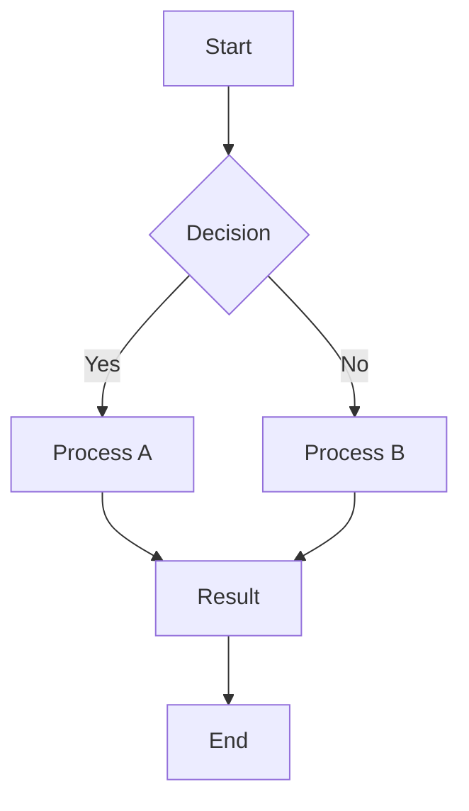
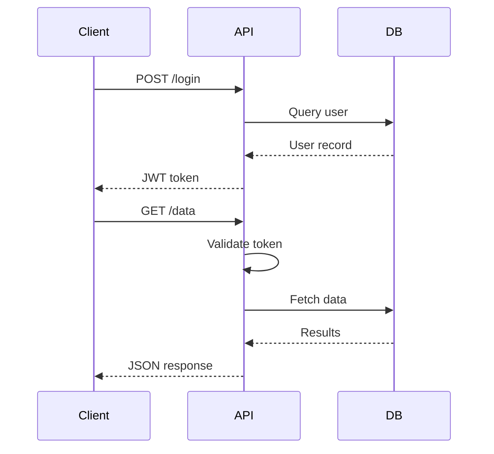
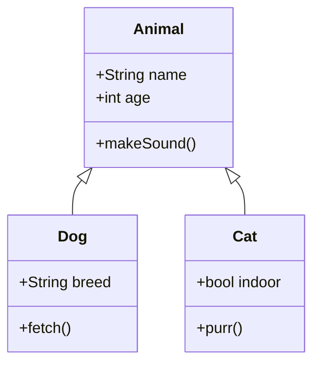
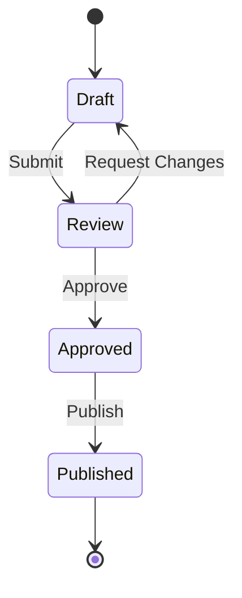
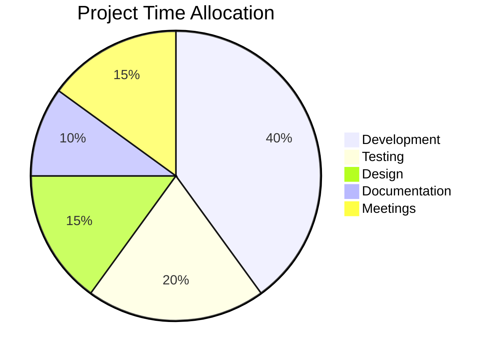
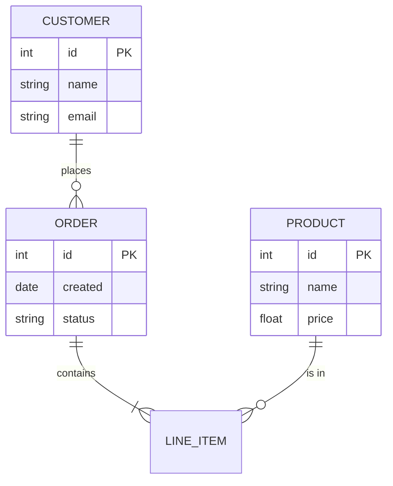
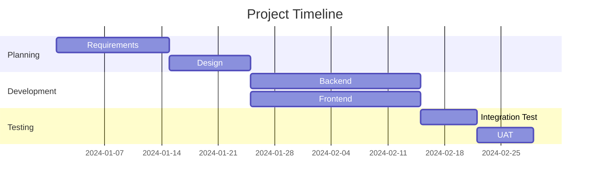
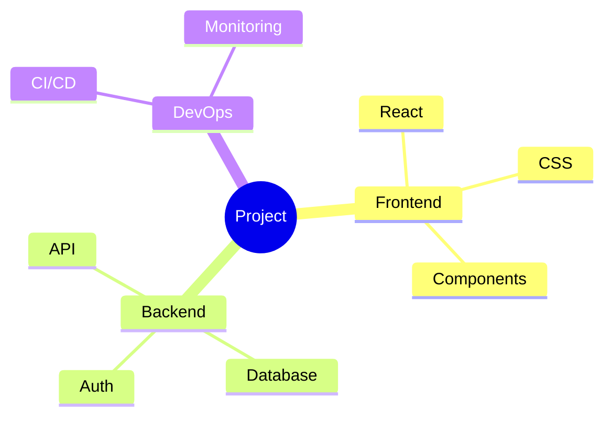

# Mermaid Diagram Examples

This document demonstrates rendering of mermaid diagrams in PDF output. Each diagram type is rendered using the active theme's mermaid color palette.

## Flowchart

## Sequence Diagram

## Class Diagram

## State Diagram

## Pie Chart

## Entity Relationship Diagram

## Gantt Chart

## Mindmap

